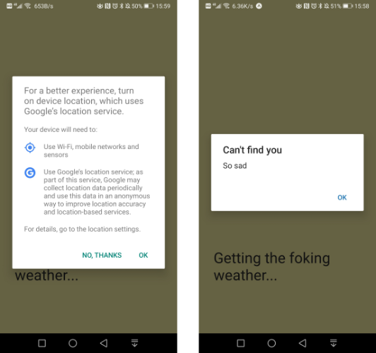
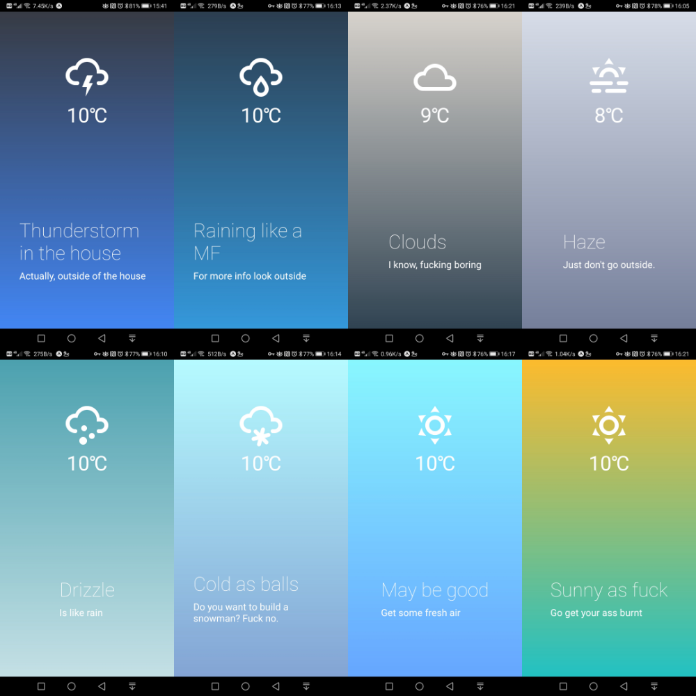

# weather_app

## React Native with Expo

> Expo is an open-source platform for making universal native apps for Android, iOS, and the web with JavaScript and React.<br>
> You can test app on phone, or build ios on Window. It supports good API.
> https://docs.expo.io/

---

## 1. Usage

Scan QRcode with Expo


## 2. Set up project

Install Expo

```
npm install -g expo-cli
```

Init Expo project

```
expo init weather_app
```

> Choose `blank` template.<br> `app.json` is configuration file which expo read.

Start Project

```
npm start
```

## 3. App.js

> When App did mount, first get location then get weather.
> Before getting weather it shows Loading Component, after getting weather shows Weather Component.

```js
export default class extends React.Component {
  state = {
    isLoading: true,
    temp,
    condition,
  };

  getWeather = async () => {
    /*set temp, condition...*/
  };

  getLocation = async () => {
    /*get location info and give to getWeather...*/
  };

  componentDidMount() {
    this.getLocation(); // when app is ready, get location first
  }

  render() {
    const { isLoading, temp, condition } = this.state;

    return;
    isLoading ? (
      <Loading />
    ) : (
      <Weather temp={Math.round(temp)} condition={condition} />
    );
  }
}
```

## 4. Get Location

> Expo has more API of location than React Native has.



Install Expo Location

```
expo install expo-location
```

```js
import * as Location from "expo-location";

getLocation = async () => {
  try {
    // ask user for getting location permission
    await Location.requestPermissionsAsync();
    // get latitude, longitude from getCurrentPositionAsync method
    const {
      coords: { latitude, longitude },
    } = await Location.getCurrentPositionAsync();
    // send latitude, longitude to getWeather method
    this.getWeather(latitude, longitude);
  } catch (error) {
    // fail to get permission of getting location
    Alert.alert("Can't find you", "So sad");
  }
};
```

## 5. Get Weather

> Use OpenWeather API
> https://openweathermap.org/current<br>
> I chose geographic coordinates, so need `latitude` and `longitutde`



Fetch Data

```
npm add axios
```

```js
import axios from "axios";

getWeather = async (latitude, longitude) => {
  // give url with latitude, longitude to openweathermap API and get data of current location
  const {
    data: {
      main: { temp },
      weather,
    },
  } = await axios.get(
    `http://api.openweathermap.org/data/2.5/weather?lat=${latitude}&lon=${longitude}&appid=${API_KEY}&units=metric`
  );

  // set isLoading, temp, condition states
  this.setState({
    isLoading: false,
    temp,
    condition: weather[0].main,
  });
};
```

## 6. Show Weather View

> `expo-linear-gradient` provides a native React view that transitions between multiple colors in a linear direction.
> We use it on background color of app.
> https://docs.expo.io/versions/latest/sdk/linear-gradient/

```
expo install expo-linear-gradient
```

> expo-status-bar gives you a component and imperative interface to control the app status bar to change its text color, background color, hide it, make it translucent or opaque, and apply animations to any of these changes.
> https://docs.expo.io/versions/latest/sdk/status-bar/

```
expo install expo-status-bar
```

> This library is installed by default on the template project that get through expo init. It includes popular icon sets
> https://docs.expo.io/guides/icons/

```js
import { StatusBar } from "react-native";
import { MaterialCommunityIcons } from "@expo/vector-icons";
import { LinearGradient } from "expo-linear-gradient";
```

### 1) Give Prop Types to Weather View

Runtime type checking for React props and similar objects

```
npm install --save prop-types
```

```js
import PropTypes from "prop-types";

Weather.propTypes = {
  temp: PropTypes.number.isRequired,
  condition: PropTypes.oneOf([
    "Haze",
    "Thunderstorm",
    "Drizzle",
    "Rain",
    "Snow",
    "Atmosphere",
    "Clear",
    "Clouds",
    "Mist",
    "Dust",
  ]).isRequired,
};
```

### 2) Style

React Native implement css, which is used like JS object.

```js
import { StyleSheet, View, Text } from "react-native";

export default function Home() {
  return (
    <View style={styles.container}>
      <Text style={styles.text}>Hello</Text>
    </View>
  );
}

const styles = StyleSheet.create({
  container: {
    flex: 1,
    justifyContent: "flex-end",
    paddingHorizontal: 30, // react native padding
    paddingVertical: 100, // react native padding
    backgroundColor: "#FDF6AA",
  },
  text: {
    color: "#2c2c2c",
    fontSize: 30, // don't need to write px in react native
  },
});
```
